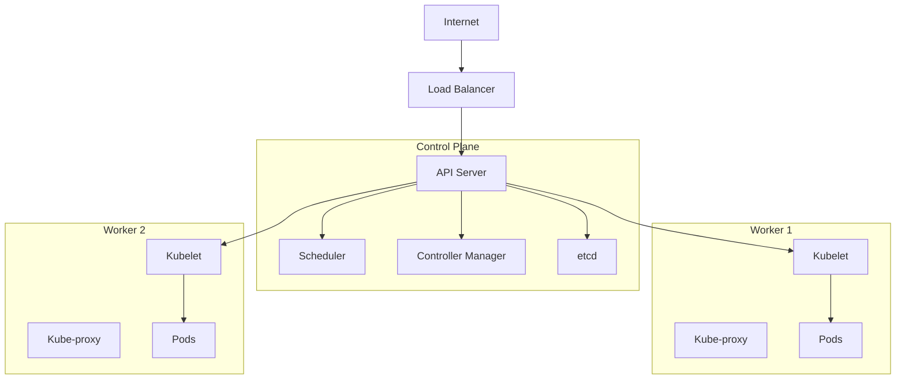

# Déployer un Cluster Kubernetes en Production

Kubernetes est devenu la plateforme de référence pour orchestrer des conteneurs en production. Mais passer d'un environnement de développement à un cluster production-ready nécessite une compréhension approfondie des concepts et des bonnes pratiques. Dans cet article, je partage mon expérience de déploiement d'un cluster Kubernetes sécurisé et scalable.

## Pourquoi Kubernetes ?

Après avoir géré des applications conteneurisées avec Docker Compose pendant plusieurs mois, j'ai rapidement atteint les limites de cette approche :

- **Scalabilité limitée** : difficile de scaler automatiquement selon la charge
- **Pas de self-healing** : en cas de crash d'un conteneur, aucune remise en route automatique
- **Déploiement manuel** : rollouts et rollbacks laborieux
- **Gestion réseau complexe** : service discovery et load balancing artisanaux

Kubernetes résout tous ces problèmes et bien plus encore.

## Architecture du Cluster

J'ai opté pour une architecture à 3 nœuds :

### Control Plane (1 nœud)
- **4 vCPU** / **8 GB RAM** / **50 GB SSD**
- Héberge : API Server, Scheduler, Controller Manager, etcd
- OS : Ubuntu 22.04 LTS

### Worker Nodes (2 nœuds)
- **8 vCPU** / **16 GB RAM** / **200 GB SSD** chacun
- Exécutent les workloads applicatifs
- OS : Ubuntu 22.04 LTS



## Installation avec kubeadm

J'ai choisi **kubeadm** pour sa simplicité et sa conformité aux standards Kubernetes. Voici les étapes clés :

### 1. Préparation des nœuds

Sur tous les nœuds, j'ai commencé par désactiver le swap et configurer les modules kernel :

```bash
# Désactiver le swap (requis par Kubernetes)
sudo swapoff -a
sudo sed -i '/ swap / s/^\(.*\)$/#\1/g' /etc/fstab

# Charger les modules nécessaires
cat <<EOF | sudo tee /etc/modules-load.d/k8s.conf
overlay
br_netfilter
EOF

sudo modprobe overlay
sudo modprobe br_netfilter

# Configuration sysctl
cat <<EOF | sudo tee /etc/sysctl.d/k8s.conf
net.bridge.bridge-nf-call-iptables  = 1
net.bridge.bridge-nf-call-ip6tables = 1
net.ipv4.ip_forward                 = 1
EOF

sudo sysctl --system
```

### 2. Installation de containerd

```bash
# Installation de containerd
sudo apt-get update
sudo apt-get install -y containerd

# Configuration de containerd
sudo mkdir -p /etc/containerd
containerd config default | sudo tee /etc/containerd/config.toml

# Utiliser systemd comme cgroup driver
sudo sed -i 's/SystemdCgroup = false/SystemdCgroup = true/' /etc/containerd/config.toml

sudo systemctl restart containerd
sudo systemctl enable containerd
```

### 3. Installation de kubeadm, kubelet et kubectl

```bash
# Ajout du repository Kubernetes
sudo apt-get update
sudo apt-get install -y apt-transport-https ca-certificates curl gpg

curl -fsSL https://pkgs.k8s.io/core:/stable:/v1.29/deb/Release.key | \
  sudo gpg --dearmor -o /etc/apt/keyrings/kubernetes-apt-keyring.gpg

echo 'deb [signed-by=/etc/apt/keyrings/kubernetes-apt-keyring.gpg] https://pkgs.k8s.io/core:/stable:/v1.29/deb/ /' | \
  sudo tee /etc/apt/sources.list.d/kubernetes.list

# Installation
sudo apt-get update
sudo apt-get install -y kubelet kubeadm kubectl
sudo apt-mark hold kubelet kubeadm kubectl
```

### 4. Initialisation du Control Plane

Sur le nœud master uniquement :

```bash
sudo kubeadm init \
  --pod-network-cidr=10.244.0.0/16 \
  --apiserver-advertise-address=<MASTER_IP> \
  --control-plane-endpoint=<MASTER_IP>

# Configuration de kubectl
mkdir -p $HOME/.kube
sudo cp -i /etc/kubernetes/admin.conf $HOME/.kube/config
sudo chown $(id -u):$(id -g) $HOME/.kube/config
```

### 5. Installation du CNI (Calico)

J'ai choisi Calico pour sa performance et ses fonctionnalités de network policy :

```bash
kubectl create -f https://raw.githubusercontent.com/projectcalico/calico/v3.27.0/manifests/tigera-operator.yaml
kubectl create -f https://raw.githubusercontent.com/projectcalico/calico/v3.27.0/manifests/custom-resources.yaml
```

### 6. Ajout des Worker Nodes

Sur chaque worker, exécuter la commande fournie par `kubeadm init` :

```bash
sudo kubeadm join <MASTER_IP>:6443 \
  --token <TOKEN> \
  --discovery-token-ca-cert-hash sha256:<HASH>
```

## Sécurisation du Cluster

### RBAC et Service Accounts

J'ai mis en place une politique RBAC stricte. Exemple pour un développeur :

```yaml
apiVersion: rbac.authorization.k8s.io/v1
kind: Role
metadata:
  namespace: production
  name: developer
rules:
- apiGroups: ["", "apps", "batch"]
  resources: ["pods", "deployments", "jobs", "services"]
  verbs: ["get", "list", "watch"]
- apiGroups: [""]
  resources: ["pods/logs"]
  verbs: ["get", "list"]
---
apiVersion: rbac.authorization.k8s.io/v1
kind: RoleBinding
metadata:
  name: developer-binding
  namespace: production
subjects:
- kind: User
  name: dev-user
  apiGroup: rbac.authorization.k8s.io
roleRef:
  kind: Role
  name: developer
  apiGroup: rbac.authorization.k8s.io
```

### Network Policies

Pour isoler les namespaces et contrôler le trafic :

```yaml
apiVersion: networking.k8s.io/v1
kind: NetworkPolicy
metadata:
  name: deny-all-ingress
  namespace: production
spec:
  podSelector: {}
  policyTypes:
  - Ingress
---
apiVersion: networking.k8s.io/v1
kind: NetworkPolicy
metadata:
  name: allow-frontend-to-backend
  namespace: production
spec:
  podSelector:
    matchLabels:
      role: backend
  policyTypes:
  - Ingress
  ingress:
  - from:
    - podSelector:
        matchLabels:
          role: frontend
    ports:
    - protocol: TCP
      port: 8080
```

### Pod Security Standards

Activation du Pod Security Admission :

```yaml
apiVersion: v1
kind: Namespace
metadata:
  name: production
  labels:
    pod-security.kubernetes.io/enforce: restricted
    pod-security.kubernetes.io/audit: restricted
    pod-security.kubernetes.io/warn: restricted
```

## Storage avec Longhorn

Pour le stockage persistant, j'utilise **Longhorn** qui offre de la réplication et des snapshots :

```bash
# Installation via Helm
helm repo add longhorn https://charts.longhorn.io
helm repo update
helm install longhorn longhorn/longhorn --namespace longhorn-system --create-namespace
```

Exemple de PersistentVolumeClaim :

```yaml
apiVersion: v1
kind: PersistentVolumeClaim
metadata:
  name: postgres-pvc
  namespace: production
spec:
  accessModes:
    - ReadWriteOnce
  storageClassName: longhorn
  resources:
    requests:
      storage: 20Gi
```

## Monitoring avec Prometheus Stack

Le monitoring est essentiel en production. J'ai déployé la stack **kube-prometheus** :

```bash
helm repo add prometheus-community https://prometheus-community.github.io/helm-charts
helm repo update

helm install prometheus prometheus-community/kube-prometheus-stack \
  --namespace monitoring \
  --create-namespace \
  --set prometheus.prometheusSpec.retention=30d \
  --set grafana.adminPassword=<PASSWORD>
```

Cette stack inclut :
- **Prometheus** pour la collecte de métriques
- **Grafana** pour la visualisation
- **Alertmanager** pour les alertes
- **Node Exporter** pour les métriques système

## Gestion des Logs avec Loki

Pour centraliser les logs, j'ai ajouté **Loki** :

```bash
helm install loki grafana/loki-stack \
  --namespace monitoring \
  --set grafana.enabled=false \
  --set prometheus.enabled=false \
  --set loki.persistence.enabled=true \
  --set loki.persistence.size=50Gi
```

## Ingress avec NGINX et Cert-Manager

Pour exposer les applications, j'utilise **NGINX Ingress Controller** avec des certificats SSL automatiques via **cert-manager** :

```bash
# NGINX Ingress
helm install ingress-nginx ingress-nginx/ingress-nginx \
  --namespace ingress-nginx \
  --create-namespace

# Cert-Manager
helm install cert-manager jetstack/cert-manager \
  --namespace cert-manager \
  --create-namespace \
  --set installCRDs=true
```

Configuration d'un Ingress avec TLS :

```yaml
apiVersion: networking.k8s.io/v1
kind: Ingress
metadata:
  name: myapp-ingress
  namespace: production
  annotations:
    cert-manager.io/cluster-issuer: "letsencrypt-prod"
    nginx.ingress.kubernetes.io/ssl-redirect: "true"
spec:
  ingressClassName: nginx
  tls:
  - hosts:
    - myapp.example.com
    secretName: myapp-tls
  rules:
  - host: myapp.example.com
    http:
      paths:
      - path: /
        pathType: Prefix
        backend:
          service:
            name: myapp-service
            port:
              number: 80
```

## Backup et Disaster Recovery

J'utilise **Velero** pour les backups complets du cluster :

```bash
velero install \
  --provider aws \
  --plugins velero/velero-plugin-for-aws:v1.9.0 \
  --bucket my-k8s-backups \
  --backup-location-config region=eu-west-1 \
  --snapshot-location-config region=eu-west-1 \
  --secret-file ./credentials-velero
```

Backup automatique quotidien :

```bash
velero schedule create daily-backup \
  --schedule="0 2 * * *" \
  --include-namespaces production,staging
```

## Optimisations et Bonnes Pratiques

### Resource Requests & Limits

Toujours définir des requests et limits :

```yaml
resources:
  requests:
    memory: "256Mi"
    cpu: "250m"
  limits:
    memory: "512Mi"
    cpu: "500m"
```

### Health Checks

Configurer liveness et readiness probes :

```yaml
livenessProbe:
  httpGet:
    path: /healthz
    port: 8080
  initialDelaySeconds: 30
  periodSeconds: 10

readinessProbe:
  httpGet:
    path: /ready
    port: 8080
  initialDelaySeconds: 5
  periodSeconds: 5
```

### Horizontal Pod Autoscaler

Pour scaler automatiquement selon la charge :

```yaml
apiVersion: autoscaling/v2
kind: HorizontalPodAutoscaler
metadata:
  name: myapp-hpa
  namespace: production
spec:
  scaleTargetRef:
    apiVersion: apps/v1
    kind: Deployment
    name: myapp
  minReplicas: 2
  maxReplicas: 10
  metrics:
  - type: Resource
    resource:
      name: cpu
      target:
        type: Utilization
        averageUtilization: 70
```

## Résultats et Métriques

Après 3 mois en production :

- ✅ **Uptime** : 99.95%
- ✅ **Temps de déploiement** : réduit de 30 minutes à 3 minutes
- ✅ **Auto-scaling** : gère automatiquement les pics de charge
- ✅ **Coûts** : optimisés grâce au bin-packing des pods
- ✅ **Rollbacks** : 0 downtime avec les rolling updates

## Conclusion

Déployer Kubernetes en production est un challenge passionnant qui nécessite une bonne compréhension de nombreux concepts. L'investissement en vaut largement la chandelle : mon infrastructure est maintenant résiliente, scalable et beaucoup plus facile à gérer.

**Points clés à retenir** :
- Toujours activer RBAC et les Network Policies
- Monitorer dès le jour 1 (Prometheus + Grafana)
- Implémenter des backups automatiques
- Définir des resource limits sur tous les pods
- Utiliser des health checks systématiquement

Dans un prochain article, je détaillerai comment j'ai mis en place un pipeline CI/CD GitOps avec ArgoCD pour déployer automatiquement sur ce cluster.

**Questions ou suggestions ?** N'hésitez pas à me contacter via les liens ci-dessous !
